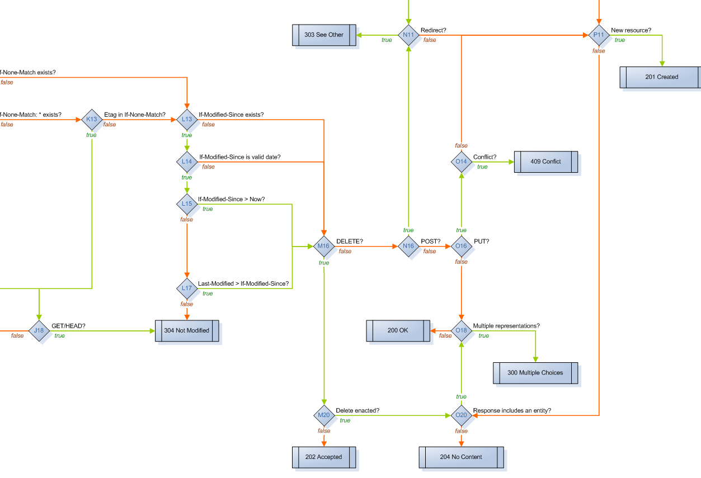

Unfiltered Directives
=====================
Jon-Anders Teigen

[@jteigen]("http://twitter.com/jteigen")

[Arktekk]("http://arktekk.no")

---

2012
===

Presented an idea @ flatMap(Oslo)

---

2013
====

* Part of Unfiltered 0.6.8
* Used in production
* 0.7.0 just out - more features!
* Documentation!

---

Agenda
======
* the problem
* the solution
* some cool features

---

Why ?
=====
Writing correct and well behaved http applications is hard

---

How hard ?
==========
[rfc 2616](http://www.w3.org/Protocols/rfc2616/rfc2616.html) - 176 pages

Plenty of semantics

---


---



---

~~<span style="color:red">"web frameworks"</span>~~
----------------

server side browser frameworks
------------------------------
* javascript
* css
* build system
* templating
* json
* ajax
* state management
* database access
* ignorance
* complexity

---

I want
==============
* http
* simplicity
* control
* composition

---

Unfiltered
==========
Unfiltered is a toolkit for servicing HTTP requests in Scala. 
It provides a consistent vocabulary for handling requests on various server backends, 
without impeding direct access to their native interfaces.

---

Unfiltered
==============
* http <font color="green">✓</font>
* simplicity <font color="green">✓</font>
* control <font color="green">✓</font>
* composition <font color="yellow">✓</font>

---

Unfiltered
----------


---

You
---


---

Your app
-------


---

Unfiltered is awesome!
----------------------
```scala
def intent = {
  case GET(Path("/example")) => 
    Ok ~> ResponseString("nice..")
}
```

```
(200) curl http://localhost:8080/example
nice..
```

---

How does it work ?
------------------
```scala
// unfiltered provides
object GET { 
  def unapply(r:Request) = 
    if(r.method.equalsIgnoreCase("get")) Some(r) else None 
}

object Path {
  def unapply(r:Request) =
    Some(req.uri.split('?')(0))
}

// you implement
def intent:PartialFunction[Request, Response]

// unfiltered does
if(intent.isDefinedAt(request))
  intent(request)
else
  NotFound
```


---

But can be devious
------------------
```scala
def intent = {
  case GET(Path("/example")) => 
    Ok ~> ResponseString("nice..")
}
```

```
(200) curl http://localhost:8080/example
nice

(404) curl -XPOST http://localhost:8080/example
```

---

Lets fix it
-----------

```scala
def intent = {
  case req @ Path("/example") => req match {
    case GET(_) => Ok ~> ResponseString("nice")
    case _      => MethodNotAllowed	
  }
}
```

```
(200) curl http://localhost:8080/example

(405) curl -XPOST http://localhost:8080/example
```

---

Something more complex
----------------------

```scala
def intent = {
  case req @ Path("/example") => req match {
    case POST(_) => req match {
      case RequestContentType("application/json") => req match {
        case Accepts.Json(_) =>
          Ok ~> JsonContent ~> ResponseBytes(Body.bytes(req))
        case _ => NotAcceptable
      }
      case _ => UnsupportedMediaType
    }
    case _ => MethodNotAllowed
  }
}
```

---

Correct, but not awesome
------------------------


---

Do we need correctness ?
------------------------


---

What is the problem ?
---------------------
* how we match
* when it doesn't match

---

Partial functions
----------------
```scala
// you implement
def intent:PartialFunction[Request, Response]

// unfiltered does
if(intent.isDefinedAt(request)) 
  intent(request) 
else 
  NotFound
```

---

Correct Behaviour
-------------
```scala
def intent = {
  case req @ Path("/a") => req match { .. }
  case req @ Path("/b") => req match { .. }
}
```

---

Enforcing it
------------

```scala
def PathIntent(pf:PartialFunction[String, Request => Response])
    :PartialFunction[Request, Response] = {

  case req @ Path(path) if pf.isDefinedAt(path) => pf(path)(req)
}

def intent = PathIntent {
  case "/a" => req => ..
  case "/b" => req => ..
}
```

---

What is the problem ?
---------------------
* ~~<span style="color:green">how we match</span>~~
* when it doesn't match

---

Failure is not an option
------------------------
```scala
object POST {
  def unapply(req:Request) = 
    if(req.method.equalsIgnoreCase("post")) Some(req) else None
}

req match {
  case POST(_) => ..
  case _       => MethodNotAllowed
}
```

---

a better result
----------------
```scala
sealed trait Result[+A]{
  def map[B](f:A => B):Result[B]
  def flatMap[B](f:A => Result[B]):Result[B]
}
case class Success[A](value:A) extends Result[A]
case class Failure(response:Response) extends Result[Nothing]
```

---

failing properly
----------------
```scala
def post(req:Request) = req match {
  case POST(_) => Success(())
  case _       => Failure(MethodNotAllowed)
}

def contentType(tpe:String, req:Request) = req match {
  case RequestContentType(`tpe`) => Success(())
  case _                         => Failure(UnsupportedMediaType)
}
```

---

```scala
def PathIntent(pf:PartialFunction[String, Request => Result[Response]]) = {
  case req @ Path(path) if pf.isDefinedAt(path) =>
    pf(path)(req) match {
	  case Success(response) => response
	  case Failure(response) => response
    }
}

def intent = PathIntent {
  case "/example" => req =>
    for {
      _ <- post(req)
      _ <- contentType("application/json", req)
    } yield Ok ~> ...
}
```

---

Directives
----------
```scala
case class Directive[A](run:Request => Result[A]) 
    extends (Request => Result[A]){

  def apply(req:Request) = run(req)

  def map[A](f:A => B):Directive[B] = 
    Directive(r => run(r).map(f))

  def flatMap[B](f:A => Directive[B]):Directive[B] = 
    Directive(r => run(r).flatMap(a => f(a)(r)))
}
```

---

Reuse Unfiltered
----------------
```scala
def request = Directive(r => Success(r))

implicit def method(M:Method) = Directive {
  case M(_) => Success(())
  case _    => Failure(MethodNotAllowed)
}

implicit val contentType = Directive.Eq { 
  (R:RequestContentType.type, value:String) =>
    when{ case R(`value`) => } orElse UnsupportedMediaType
}
```

---

Remember this one ?
-------------------
```scala
def intent = {
  case req @ Path("/example") => req match {
    case POST(_) => req match {
      case RequestContentType("application/json") => req match {
        case Accepts.Json(_) =>
          Ok ~> JsonContent ~> ResponseBytes(Body.bytes(req))
        case _ => NotAcceptable
      }
      case _ => UnsupportedMediaType
    }
    case _ => MethodNotAllowed
  }
}
```

---

Awesomeness restored
--------------------
```scala
def intent = Intent.Path {
  case "/example" => for {
    _   <- POST
    _   <- RequestContentType === "application/json"
    _   <- Accepts.Json
    req <- request
  } yield Ok ~> JsonContent ~> ResponseBytes(Body bytes req)
}
```

---

Build your own
--------------
```scala
def bytes = request.map(r => Body bytes r)

def jsonIO = for {
  _ <- RequestContentType === "application/json"
  _ <- Accepts.Json
  b <- bytes
} yield b
```

```scala
def intent = Intent.Path {
  case "/example" => for {
    _   <- POST
    b   <- jsonIO
  } yield Ok ~> JsonContent ~> ResponseBytes(b)
}
```

--

Before
-------
```scala
def handle(req: HttpRequest[HttpServletRequest], adType: String)
    : ResponseFunction[HttpServletResponse] = 
  req match {
    case GET(_) => req match {

      case AnyAccepter(_) | AtomAccepter(_) => adType match {
        case Configuration.SearchPath(c) => {
          try {
            val sr = doSearch(c, req)
            val orgHierarchy = OrganizationHierarchyHandler.toOrgHierarchy(req, organisationService)
            val resourceOwnersHeader = orgHierarchy.flatMap{o: AdMapperTypes.OrgHierarchyString => 
            
              OrganizationHierarchyHandler.toResourceOwnersHeader(o) }
            CacheControlBuilder(MaxAge(HttpCacheConfiguration.search)) ~> AtomResponse(sr, headers = resourceOwnersHeader.map{Seq(_)}.getOrElse(Seq.empty))
          
          } catch {
            case e: NonFatal => {
              logger.error("Error during search", e)
              InternalServerError

           }

         }

       }

       case _ => NotFound

     }

     case _ => NotAcceptable

   }

   case _ => MethodNotAllowed

 }
```

--

After
------
```scala
def handle(adType: String) = for {

 _ <- GET

 _ <- * | Atom

 c <- searchPath(adType)

 r <- request[HttpServletRequest]

 s <- tryOrElse(doSearch(c, r), InternalServerError)
} yield {

 val orgHierarchy = OrganizationHierarchy.toOrgHierarchy(r, orgService)

 val resourceOwnersHeader = orgHierarchy.flatMap { o =>

   OrganizationHierarchy.toResourceOwnersHeader(o)
  }

 CacheControlBuilder(MaxAge(HttpCacheConfiguration.search)) ~>

   AtomResponse(s, headers = resourceOwnersHeader.map(Seq(_)).getOrElse(Nil))
}
```

---

If at first you don't succeed
-----------------------------
```scala
val a = for {
  _ <- GET
  _ <- failure(BadRequest)
} yield Ok ~> ResponseString("a")

val b = for {
  _ <- POST
} yield Ok ~> ResponseString("b")

def intent = Intent.Path { 
  case "/x" =>  a | b 
}
```

---

can you spot the problem ?
--------------------------
```scala
val a = for {
  _ <- GET
  _ <- failure(BadRequest)
} yield Ok ~> ResponseString("a")

val b = for {
  _ <- POST
} yield Ok ~> ResponseString("b")

def intent = Path.Intent { 
  case "/x" =>  a | b 
}
```
```
curl http://localhost/x

? 400 Bad Request
? 405 Method Not Allowed
? 200 Ok ("a")
? 200 OK ("b")
```

---

commitment!
-----------
```scala
val a = for {
  _ <- GET
  _ <- commit
  _ <- failure(BadRequest)
} yield Ok ~> ResponseString("a")

val b = for {
  _ <- POST
} yield Ok ~> ResponseString("b")
```
```
curl http://localhost:8080/x
400 Bad Request
```

---

how does commit work ?
----------------------
```scala
// 3 types
Result[A] = Success(a) | Failure(response) | Error(response)

// rewrites
commit(Success) == Success
commit(Failure) == Error
commit(Error)   == Error

// combines
Success | X == Success
Failure | X == X
Error   | X == Error
```

---

Improving Failure
------------------
```scala
for {
  _ <- POST.fail ~> ResponseString("I pity the fool who can't POST!")
} yield ...
```
```
curl -XGET http://...

405 I pity the fool who can't POST!
```

---

parameters and interpreters
---------------------------
```scala
for {
  a <- data.as.Int named "a"
  b <- data.as.Int.fail( (k,v) => 
         BadRequest ~> ResponseString(s"$v is not a valid int for $k")
       ) named "b"
} yield ResponseString((a ++ b).sum)
```
```
curl http://localhost:8080 -d a=5 -d b=12
(200) 17

curl http://localhost:8080 -d a=x -d b=12
(200) 12

curl -v http://localhost:8080 -d a=5 -d b=1x
(400) 1x is not a valid int for b
```

---

reusing interpreters
--------------------
```scala
implicit val intV = data.asString ~> data.as.Int.fail((k,v) =>
  BadRequest ~> ResponseString(s"$v is not a valid int for $k"))

implicit def required[T] = data.Requiring[T].fail(name => 
  BadRequest ~> ResponseString(name + " is missing")
)

for {
  opt <- data.as.Option[Int] named "opt"
  req <- data.as.Required[String] named "req"
} yield ResponseString(s"opt: $opt req: $req")
```

```
curl http://localhost:8080 -d opt=5 -d req=x
(200) opt: Some(5) req: x

curl http://localhost:8080 -d req=x
(200) opt: None req: x

http://localhost:8080
(400) req is missing

http://localhost:8080 -d opt=x
(400) x is not a valid int for opt
```

---

joining & splitting
-------------------
```scala
case class BadParam(msg: String) extends ResponseJoiner(msg)(
  msgs => BadRequest ~> ResponseString(msgs.mkString("","\n","\n")))

implicit val intV = data.as.String ~> data.as.Int.fail((k,v) =>
  BadParam(s"$v is not a valid int for $k"))

implicit def required[T] = data.Requiring[T].fail(name => 
  BadParam(name + " is missing"))
```
```scala
for {
  (opt & req) <- 
    (data.as.Option[Int] named "opt") &
    (data.as.Required[String] named "req")
} yield ResponseString(s"opt: $opt req: $req")
```
```
curl http://localhost:8080 -d opt=x
(400) x is not a valid int for opt
      req is missing 
```

---

custom interpreters
-------------------
```scala
case class Tool(name: String)

val toolStore = Map(
  1 -> Tool("Rock"),
  2 -> Tool("Paper"),
  3 -> Tool("Scissors")
)

val asTool = data.Fallible[Int,Tool](toolStore.get).fail(
  (k,v) => BadParam(s"$v is not a valid tool identifier"))

implicit val implyTool = data.as.String ~> data.as.Int ~> asTool

for {
  tool <- data.Optional[Tool] named "tool"
} yield ResponseString(tool + "\n")
```

---

Thank you
=========
https://github.com/unfiltered/unfiltered

---

legal
------
* http://www.catversushuman.com/2013/04/my-cat-money-when-i-let-him-outside.html
